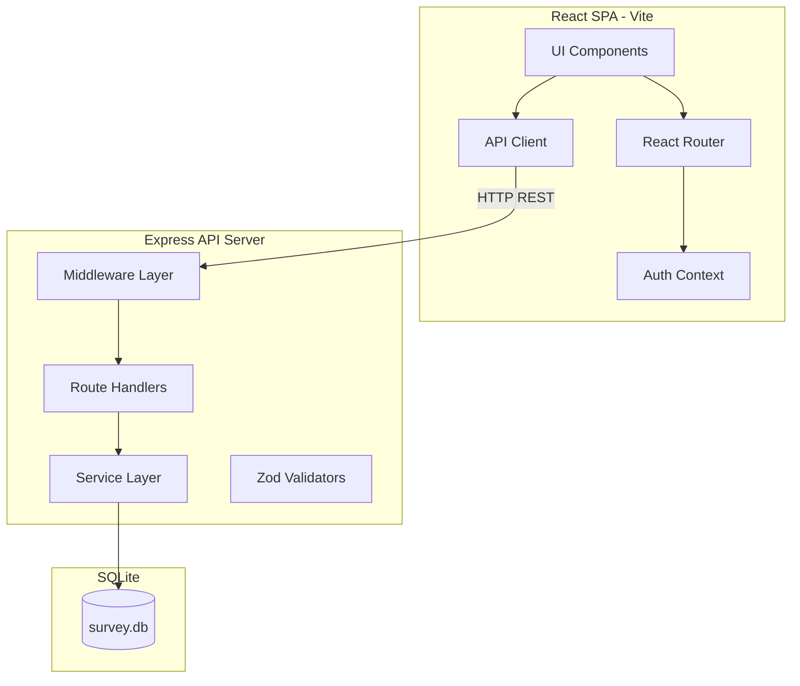

# Architecture

## Project Overview

A full-featured Survey application that allows Survey Coordinators to define, open, and close surveys, and Survey Respondents to complete surveys and view results. The application uses role-based access control with two distinct roles.

## Tech Stack

| Layer | Technology | Justification |
|-------|-----------|---------------|
| Language | TypeScript (strict mode) | Type safety across full stack |
| Frontend | React 18 + React Router v6 | Component model, ecosystem, routing |
| Styling | Tailwind CSS | Rapid UI development, responsive design |
| State Management | React Context + useReducer | Sufficient complexity for this app |
| Backend | Express.js | Mature, flexible, large middleware ecosystem |
| Database | SQLite via better-sqlite3 | Zero-config, file-based, ideal for self-contained apps |
| ORM | Drizzle ORM | Type-safe, lightweight, excellent SQLite support |
| Validation | Zod | Runtime validation with TypeScript inference |
| Auth | JWT (jsonwebtoken) + bcrypt | Stateless auth with secure password hashing |
| Testing | Vitest + React Testing Library + Supertest | Fast, modern, compatible test stack |
| Build | Vite | Fast dev server and build for frontend |
| Charts | Chart.js + react-chartjs-2 | Bonus feature: graphical survey results |

## System Architecture



## Project Structure

```
├── docs/                     # Design documents
│   ├── architecture.md
│   ├── data-model.md
│   ├── api-spec.md
│   └── requirements.md
├── server/                   # Backend
│   ├── src/
│   │   ├── index.ts          # Entry point
│   │   ├── app.ts            # Express app config
│   │   ├── db/
│   │   │   ├── schema.ts     # Drizzle schema
│   │   │   ├── index.ts      # DB connection
│   │   │   ├── migrate.ts    # Migration runner
│   │   │   └── seed.ts       # Seed data
│   │   ├── middleware/
│   │   │   ├── auth.ts       # JWT verification
│   │   │   ├── authorize.ts  # Role-based access
│   │   │   ├── validate.ts   # Zod validation
│   │   │   └── errorHandler.ts
│   │   ├── routes/
│   │   │   ├── auth.ts
│   │   │   ├── surveys.ts
│   │   │   └── responses.ts
│   │   ├── services/
│   │   │   ├── auth.ts
│   │   │   ├── survey.ts
│   │   │   └── response.ts
│   │   └── validators/
│   │       ├── auth.ts
│   │       ├── survey.ts
│   │       └── response.ts
│   ├── tsconfig.json
│   └── package.json
├── client/                   # Frontend
│   ├── src/
│   │   ├── main.tsx          # Entry point
│   │   ├── App.tsx           # Root with routing
│   │   ├── api/
│   │   │   └── client.ts     # Centralized API client
│   │   ├── components/
│   │   │   ├── Layout.tsx
│   │   │   ├── Navbar.tsx
│   │   │   ├── ProtectedRoute.tsx
│   │   │   ├── LoadingSpinner.tsx
│   │   │   └── ErrorMessage.tsx
│   │   ├── context/
│   │   │   └── AuthContext.tsx
│   │   ├── pages/
│   │   │   ├── HomePage.tsx
│   │   │   ├── LoginPage.tsx
│   │   │   ├── RegisterPage.tsx
│   │   │   ├── CreateSurveyPage.tsx
│   │   │   ├── SurveyListPage.tsx
│   │   │   ├── TakeSurveyPage.tsx
│   │   │   └── SurveyResultsPage.tsx
│   │   └── types/
│   │       └── index.ts
│   ├── index.html
│   ├── tsconfig.json
│   ├── vite.config.ts
│   └── package.json
├── .env.example
├── .gitignore
├── Survey-App.md
└── README.md
```

## Non-Functional Requirements

### Security
- Passwords hashed with bcrypt (cost factor 10)
- JWT tokens with 24h expiry stored in httpOnly-inaccessible localStorage (acceptable for this tier; httpOnly cookies are preferred for production)
- CORS restricted to frontend origin
- Rate limiting on auth endpoints
- Input validated with Zod on all endpoints
- Parameterized queries via Drizzle ORM

### Performance
- SQLite provides fast reads for survey listing
- Vite HMR for fast frontend development
- Lazy-loaded routes for code splitting

### Accessibility
- WCAG 2.1 AA compliance
- Semantic HTML elements
- Keyboard navigation for all interactions
- ARIA labels on interactive elements
- Sufficient color contrast

## Key Design Decisions

| Decision | Choice | Rationale |
|----------|--------|-----------|
| Monorepo | `server/` + `client/` in one repo | Simplicity for a self-contained app |
| Auth storage | localStorage with JWT | Simple SPA approach; no cookie/CSRF complexity |
| Database | SQLite file | Zero deployment dependencies |
| State management | React Context | Two contexts (auth + surveys) keep it simple |
| Styling | Tailwind CSS | Utility-first, responsive, no CSS files to manage |
| Radio buttons for answers | HTML radio inputs | Enforces mutually exclusive selection natively |
