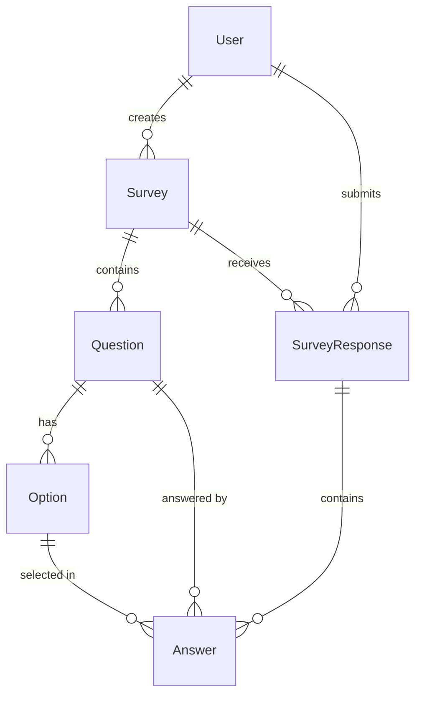
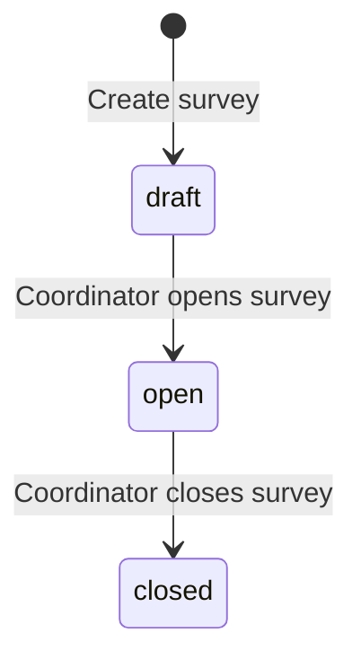

# Data Model

## Entities

### User

Represents both Survey Coordinators and Survey Respondents.

| Field | Type | Constraints | Default |
|-------|------|-------------|---------|
| id | INTEGER | PK, auto-increment | — |
| email | TEXT | NOT NULL, UNIQUE | — |
| passwordHash | TEXT | NOT NULL | — |
| name | TEXT | NOT NULL | — |
| role | TEXT (enum) | NOT NULL, `coordinator` or `respondent` | `respondent` |
| createdAt | TEXT (ISO 8601) | NOT NULL | `CURRENT_TIMESTAMP` |
| updatedAt | TEXT (ISO 8601) | NOT NULL | `CURRENT_TIMESTAMP` |

### Survey

A survey with a title and 1-10 questions.

| Field | Type | Constraints | Default |
|-------|------|-------------|---------|
| id | INTEGER | PK, auto-increment | — |
| title | TEXT | NOT NULL, max 200 chars | — |
| status | TEXT (enum) | NOT NULL, `draft` / `open` / `closed` | `draft` |
| createdBy | INTEGER | FK → User.id, NOT NULL | — |
| createdAt | TEXT (ISO 8601) | NOT NULL | `CURRENT_TIMESTAMP` |
| updatedAt | TEXT (ISO 8601) | NOT NULL | `CURRENT_TIMESTAMP` |

### Question

A multiple-choice question belonging to a survey. Each survey has 1-10 questions.

| Field | Type | Constraints | Default |
|-------|------|-------------|---------|
| id | INTEGER | PK, auto-increment | — |
| surveyId | INTEGER | FK → Survey.id, NOT NULL, CASCADE DELETE | — |
| text | TEXT | NOT NULL, max 500 chars | — |
| orderIndex | INTEGER | NOT NULL | — |
| createdAt | TEXT (ISO 8601) | NOT NULL | `CURRENT_TIMESTAMP` |

### Option

A selectable choice for a question. Each question has 1-5 options.

| Field | Type | Constraints | Default |
|-------|------|-------------|---------|
| id | INTEGER | PK, auto-increment | — |
| questionId | INTEGER | FK → Question.id, NOT NULL, CASCADE DELETE | — |
| text | TEXT | NOT NULL, max 200 chars | — |
| orderIndex | INTEGER | NOT NULL | — |

### SurveyResponse

Tracks that a respondent has submitted a survey (one per user per survey).

| Field | Type | Constraints | Default |
|-------|------|-------------|---------|
| id | INTEGER | PK, auto-increment | — |
| surveyId | INTEGER | FK → Survey.id, NOT NULL | — |
| respondentId | INTEGER | FK → User.id, NOT NULL | — |
| submittedAt | TEXT (ISO 8601) | NOT NULL | `CURRENT_TIMESTAMP` |

**Unique constraint:** `(surveyId, respondentId)` — prevents duplicate submissions.

### Answer

A single answer to a question within a survey response.

| Field | Type | Constraints | Default |
|-------|------|-------------|---------|
| id | INTEGER | PK, auto-increment | — |
| responseId | INTEGER | FK → SurveyResponse.id, NOT NULL, CASCADE DELETE | — |
| questionId | INTEGER | FK → Question.id, NOT NULL | — |
| optionId | INTEGER | FK → Option.id, NOT NULL | — |

**Unique constraint:** `(responseId, questionId)` — one answer per question per response.

## Relationships

| Relationship | Type | Cascade |
|-------------|------|---------|
| User → Survey | One-to-many | SET NULL (keep surveys if user deleted) |
| User → SurveyResponse | One-to-many | CASCADE (delete responses if user deleted) |
| Survey → Question | One-to-many | CASCADE (delete questions with survey) |
| Survey → SurveyResponse | One-to-many | CASCADE (delete responses with survey) |
| Question → Option | One-to-many | CASCADE (delete options with question) |
| Question → Answer | One-to-many | CASCADE |
| Option → Answer | One-to-many | CASCADE |
| SurveyResponse → Answer | One-to-many | CASCADE (delete answers with response) |

## State Machine: Survey Status

| Transition | Guard |
|-----------|-------|
| draft → open | Survey must have at least 1 question, each question must have at least 1 option |
| open → closed | Only coordinator who created the survey (or any coordinator) |

## Indexes

| Table | Index | Purpose |
|-------|-------|---------|
| User | UNIQUE on `email` | Login lookup |
| Survey | on `status` | List filtering by status |
| Survey | on `createdBy` | Coordinator's surveys |
| Question | on `surveyId` | Load questions for a survey |
| Option | on `questionId` | Load options for a question |
| SurveyResponse | UNIQUE on `(surveyId, respondentId)` | Prevent duplicate responses |
| Answer | UNIQUE on `(responseId, questionId)` | One answer per question |
